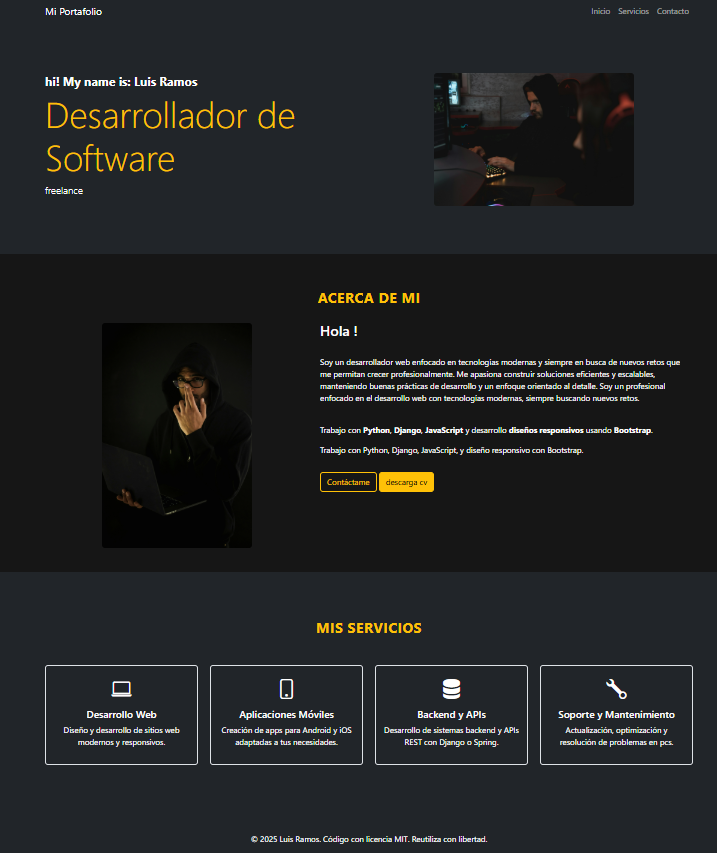

# Web Personal Profesional

Este es un sitio web tipo web personal profesional desarrollado con Django. Su propósito es presentar información personal y profesional de una persona, incluyendo su carrera, trayectoria, servicios que ofrece y la posibilidad de descargar su CV. Toda la información puede ser gestionada desde el panel de administración.

## Vista previa



## Características

- Cuenta con una página principal con presentación personal.
- Sección sobre educación academica y experiencia profesional.
- Panel de administración en django admin para gestionar contenido.
- Listado de servicios profesionales ofrecidos.
- Enlace de descarga de CV.
- Interfaz sencilla y profesional.
- Backend desarrollado con Django 5.2.4.

## 🛠️ Tecnologías utilizadas

- Python
- Django
- HTML5, CSS3
- SQLite3 (por defecto de Django)
- Bootstrap (opcional si se usa para estilos)

## ⚙️ Instalación

Sigue estos pasos para correr el proyecto en tu máquina local:

1. Clona el repositorio:
   ```bash
   git clone https://github.com/luisAngelDev/django-simple-blog.git
   cd blog-personal
   ```

2. Crea y activa un entorno virtual:
   ```bash
   python -m venv venv
   venv\Scripts\activate  # En Windows
   ```

3. Instala las dependencias:
   ```bash
   pip install -r requirements.txt
   ```

4. Aplica las migraciones:
   ```bash
   python manage.py migrate
   ```

5. Inicia el servidor:
   ```bash
   python manage.py runserver
   ```

6. Accede al sitio en tu navegador:
   ```
   http://127.0.0.1:8000/
   ```

## 🔐 Acceso al panel de administración

Puedes acceder al panel de administración de Django en:

```
http://127.0.0.1:8000/admin
```

> ⚠️ Necesitas crear un superusuario:
> ```bash
> python manage.py createsuperuser
> ```

## 📂 Estructura del proyecto

```
blog-personal/
├── manage.py
├── blog/              # App principal
│   ├── models.py
│   ├── views.py
│   ├── urls.py
│   └── templates/
├── static/            # Archivos estáticos
├── templates/         # Plantillas generales
├── media/             # Archivos subidos (CV)
├── venv/              # Entorno virtual (ignorado por git)
├── .gitignore
├── README.md
└── requirements.txt
```

## 👨‍💻 Autor

**Luis Ramos**  
[GitHub: @luisAngelDev](https://github.com/luisAngelDev) 

## 📄 Licencia
Este proyecto está bajo la Licencia MIT - consulta el archivo [LICENSE](./LICENSE) para más detalles.
